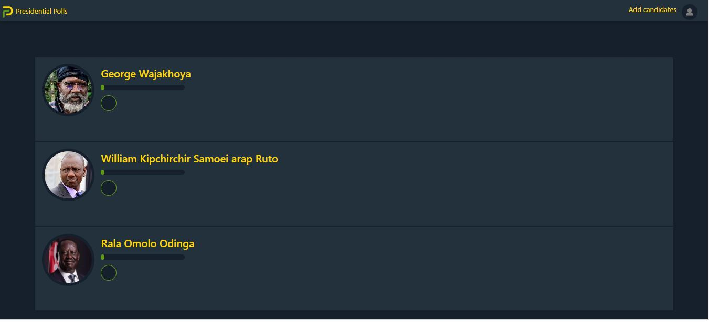

# Presidential Polls
## By Brian Kimutai Koskei
## Screenshot
 
 ## Table of Content
 - [Description](#description)
 - [Landing Page](#Landing-Page)
 - [Requirement](#Requirements)
 - [Installation Process](#installation-Process)

 - [Live Link](#Live-Link)
 - [Technology  Used](#technology-Used)
 - [Licence](#licence)
 - [Authors Info](#Authors-Info)
 ## Description
 
Users of this straightforward software may add presidential candidates and cast their votes for their preferred candidate.

## Landing page
Users may select the candidate of their choosing and either upvote or downvote on this lovely landing page.
[Go Back to the top](#Screenshot)

 ###  Requirements
 * Access to  a computer or any other accessory such as a phone
 * Access to internet
 * Chrome application
 
 ### Installation Process
 ****
* Clone to this repo : git clone https://github.com/borebrian2021/Presidential-poll.git
* Unzip the downloaded files in a folder of choice .
* Open the terminal and run npm install.
 ****
 [Go Back to the top](#Screenshot)
### Live Link
-FRONT END
- Click this link to view the live application https://presidential-poll.vercel.app/
-BACKEND
- Click this link to access  backend repository  https://github.com/borebrian2021/pollslive
- Click this link to view the live backend application https://pollslive.herokuapp.com

### Technology  Used
* HTML - which was used to develope the structure off the pages.
* React Library-Used to buld the entire application.
* VANILLA CSS - which was used to style the User Interface.
* Bootstraps-Used for achieving responsiveness.
* Framer Animation-It was used to add animation to the project.
* VANILLA Javascript-Used to make page interactive.
* RUBY 

## Licence
MIT License
Copyright (c) [2022] [Brian Kimutai]
Permission is hereby granted, free of charge, to any person obtaining a copy
of this software and associated documentation files (the "Software"), to deal
in the Software without restriction, including without limitation the rights
to use, copy, modify, merge, publish, distribute, sublicense, and/or sell
copies of the Software, and to permit persons to whom the Software is
furnished to do so, subject to the following conditions:
The above copyright notice and this permission notice shall be included in all
copies or substantial portions of the Software.
THE SOFTWARE IS PROVIDED "AS IS", WITHOUT WARRANTY OF ANY KIND, EXPRESS OR
IMPLIED, INCLUDING BUT NOT LIMITED TO THE WARRANTIES OF MERCHANTABILITY,
FITNESS FOR A PARTICULAR PURPOSE AND NONINFRINGEMENT. IN NO EVENT SHALL THE
AUTHORS OR COPYRIGHT HOLDERS BE LIABLE FOR ANY CLAIM, DAMAGES OR OTHER
LIABILITY, WHETHER IN AN ACTION OF CONTRACT, TORT OR OTHERWISE, ARISING FROM,
OUT OF OR IN CONNECTION WITH THE SOFTWARE OR THE USE OR OTHER DEALINGS IN THE
SOFTWARE.
[Go Back to the top](#Screenshot)
## Authors Info
Linkedin - [Brain Koskei Kimutai](https://www.linkedin.com/in/bore-brian-5655b814b/)